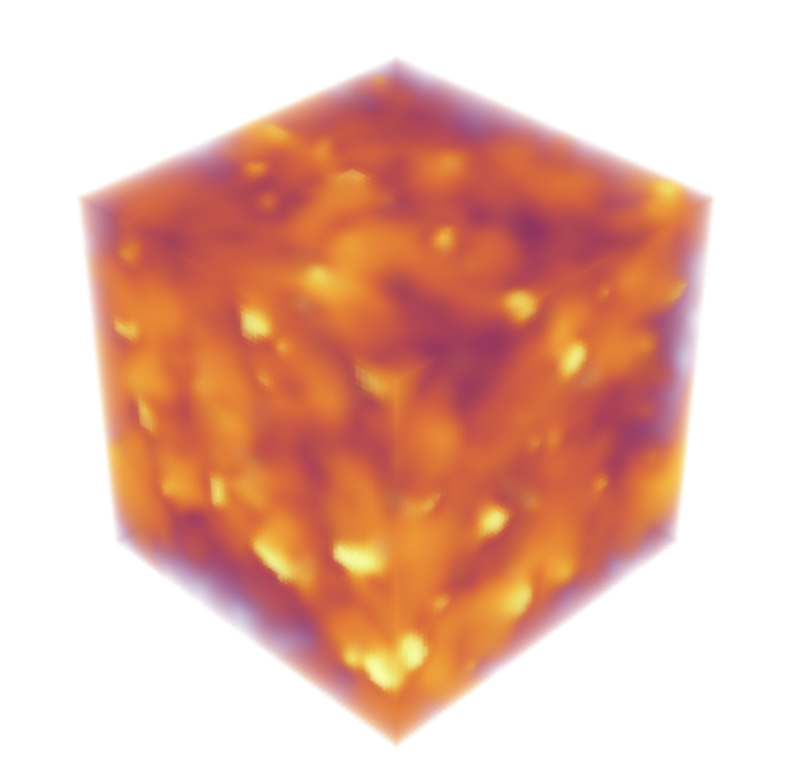
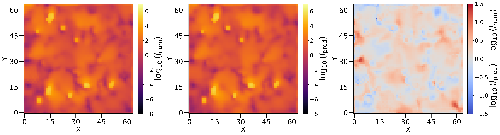
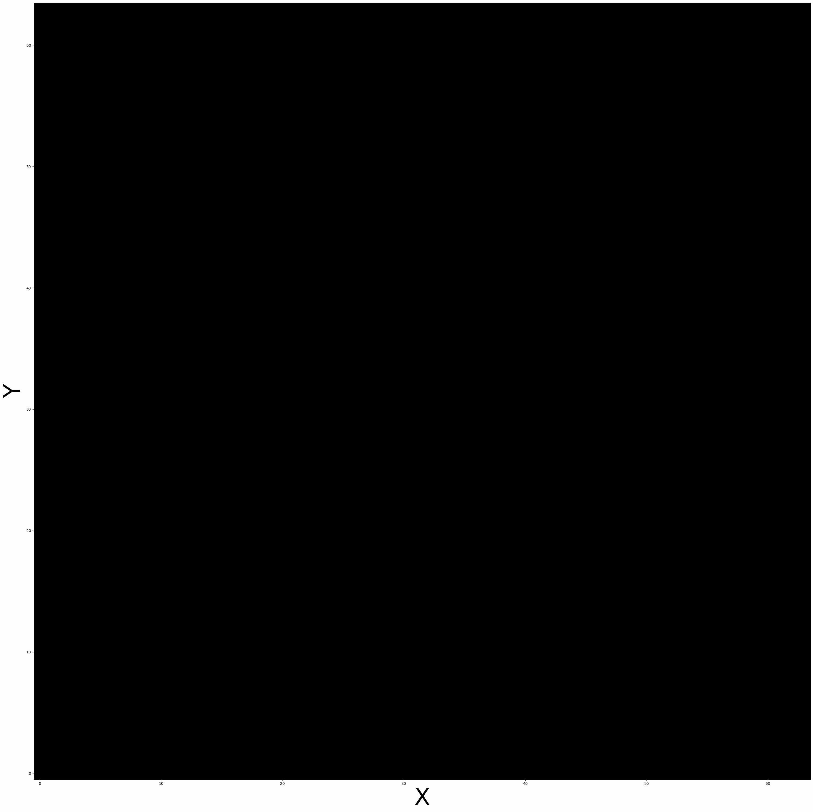

# Emulating Radiative Transfer in Astrophysical Environments

This repository is the official implementation of [Emulating Radiative Transfer in Astrophysical Environments](https://arxiv.org/abs/2030.12345). 

>📋  Optional: include a graphic explaining your approach/main result, bibtex entry, link to demos, blog posts and tutorials

Radiative transfer - cornerstone - ... - gifs und plots die einfach Vorhersage zeigen, Ergebnisplots dann unten

 HIER 3D GIF oder static von Radiative intensity einfügen

<p align="center">
  
</p>


Radiative transfer is a cornerstone of computational astrophysics, providing the essential link between physical models and observational diagnostics. Simulating the propagation of radiation through astrophysical media, such as stellar atmospheres, interstellar clouds, or galaxy clusters, requires solving the radiative transfer equation (RTE). 
Due to its high dimensionality (dependence on time $t$, spatial position $x$, direction $\omega$, and frequency $\nu$) the RTE is highly complex and computationally expensive to solve numerically.
Accurate solutions require fine resolution across all these domains, leading to significant challenges in terms of memory and computing time, particularly in multi-dimensional or time-dependent simulations.

Unfortunately, numerical methods often suffer from high computational costs, dimensionality issues, or instability
while traditional deep learning approaches often struggle with generalization across discretizations and parameter settings, 
as well as stability in high-dimensional PDE problems. 

To address these shortcomings, we employ Neural Operators, to develop surrogate models for simulating radiative transfer. We present two Neural Operator–based surrogate models for three-dimensional radiative transfer, achieving significant speedups while maintaining high accuracy.

We employ a specific class of Neural Operators known as the Fourier Neural Operator (FNO) and combines it with a U-Net architecture, following the approach chosen in this paper[CITE]. 

FIGURE VON UFNO HIERHIN


We developed two UFNO-based surrogate models for the simulation of three-dimensional radiative transfer. The first model enables time-independent predictions of radiative intensity in the steady -state limit, while the second model allows to model the temporal evolution of radiative intensity via recurrent application across time steps. Both models were implemented in JAX.

## Installation

To clone the git:

```bash
git clone https://github.com/your-anonymous-id/Astro_RT.git
cd Astro_RT
```

To install requirements:

```bash
pip install -r requirements.txt
```

sourcen + wie an dataset kommen (Describe how to set up the environment, e.g. pip/conda/docker commands, download datasets, etc...)


## Training

In our paper we consider two scenarios in which we want to emulate Radiative Transfer. For each scenario we provide code to train a surrogate model, as well as pretrained surrogate models. 
1. Prediction of steady-state radiative intensity setting in for $t \to \infty$ 
2. Temporal evolution of radiative intensity from a starting point where $I_0=0$

To train the steady-state model we provide a dataset consisting of samples, that each comprising an absorption and emission field as well as the corresponding steady-state radiative intensity. These are generated using the code from here[cite].

To train the steady-state model, run this command:

```train
python train_3d.py 
```

In this script data is split into an independent training, validation and testset and an Optuna study is run to find the best model and training hyperparameters. You can modify the script to change the intervals for the hyperparameters or load different datafiles. Alternatively you can load our pretrained model ```ufno_3d.eqx``` from the 'surrogate_models' folder.


To train the model for the temporal evolution we provide a dataset consisting of samples, that each comprising an absorption and emission field as well as the corresponding steady-state radiative intensity. These are also generated using the code from here[cite]. 
To train the model for the temporal evolution, run this command:

```train
python train_3d_time.py 
```

In this script data is split into an independent training, validation and testset and an Optuna study is run to find the best model and training hyperparameters. You can modify the script to change the intervals for the hyperparameters or load different datafiles. Alternatively you can load our pretrained model ```ufno_3d_time.eqx``` from the 'surrogate_models' folder.
CHANGE THIS DEPENDING ON IF I STORE THE SPLITTED FILES OR THE ORIGINAL FILE OR MAYBE JUST BOTH

sagen, was in beiden Dateien vohanden, etc. was man verstellen kann, sagen, dass auf die in architectures (link hinterlegen) defineirten architekturen zugreifen, Optuna etc

bei architecturen nochmal die Referenz von ufno citen

>📋  Describe how to train the models, with example commands on how to train the models in your paper, including the full training procedure and appropriate hyperparameters.

## Evaluation
-> soll ich das extra machen, wenn ja dann bei git auch evaluate.py hinzufügen

To evaluate my model on ImageNet, run:

```eval
python eval.py --model-file mymodel.pth --benchmark imagenet
```

>📋  Describe how to evaluate the trained models on benchmarks reported in the paper, give commands that produce the results (section below).

## Pre-trained Models

The two pre-trained models we present in our paper can be found in the folder surrogate models (mit link hinterlegen).
ufno_3d.eqx (hinterlegen) und ufno_3d_time.eqx (hinterlegen vorstellen)

You can download pretrained models here:

- [My awesome model](https://drive.google.com/mymodel.pth) trained on ImageNet using parameters x,y,z. 

>📋  Give a link to where/how the pretrained models can be downloaded and how they were trained (if applicable).  Alternatively you can have an additional column in your results table with a link to the models.

## Results

Following plots show a comparison of the predictions of surrogate models and numerical reference for a random sample from the test set.

Emulating radiative transfer in the steady-state case:


<p align="center">
  
</p>

Emulating radiative transfer in the temporal evolution case:

<p align="center">
  
  
</p>


Our model achieves the following performance on the test set:

| Model name           | MSE             | Absolute relative error |
|----------------------|-----------------|-------------------------|
| Steady-State Model   |     X           |      0.5%               |
| Recurrent Model      |     Y           |      Y%                 |


Optimal hyperparameters for the steady-state model and its training:

| Model hyperparameters | Value           | Training hyperparameters | Value      | 
|-----------------------|-----------------|--------------------------|------------|
| Number of Layers      |     X           | Initial Learning Rate    |     X      | 
| Width                 |     Y           | Decay Rate               |     X      | 
| Modes                 |     X           | Weight Decay             |     X      | 
| Kernel Size           |     X           | Dropout Probability      |     X      |  
| U-Net Width           |     X           | $\lambda$ in Loss        |     X      | 

Optimal hyperparameters for the recurrent model and its training:

| Model hyperparameters | Value           | Training hyperparameters | Value      | 
|-----------------------|-----------------|--------------------------|------------|
| Number of Layers      |     X           | Initial Learning Rate    |     X      | 
| Width                 |     Y           | Decay Rate               |     X      | 
| Modes                 |     X           | Weight Decay             |     X      | 
| Kernel Size           |     X           | Dropout Probability      |     X      |  
| U-Net Width           |     X           | $\lambda$ in Loss        |     X      | 

>📋  Include a table of results from your paper, and link back to the leaderboard for clarity and context. If your main result is a figure, include that figure and link to the command or notebook to reproduce it. -> d.h. ich sollte evaluate vermutlich drinhaben, aber da einfach nur plots mit model machen bzw vllt nochmal test loss

Tabelle mit accuracy relativ und mse vllt machen für beide models, vllt auch hyperparameter


## Contributing

>📋  Pick a licence and describe how to contribute to your code repository. 
