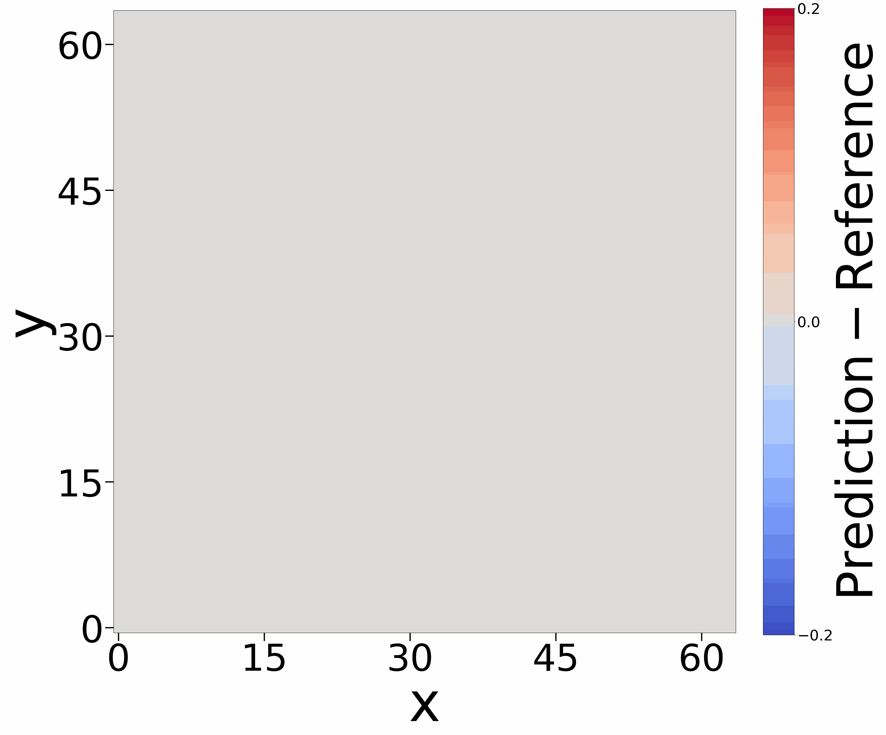

# Emulating Radiative Transfer in Astrophysical Environments

This repository contains the code accompanying the paper *Emulating Radiative Transfer in Astrophysical Environments*. 


<p align="center">
  
</p>


Radiative transfer is a cornerstone of computational astrophysics, providing the essential link between physical models and observational diagnostics. Simulating the propagation of radiation requires solving the radiative transfer equation (RTE), which, due to its high dimensionality, is computationally expensive to solve numerically ([Buck et al., 2017](https://arxiv.org/abs/1612.05277)).
Accurate solutions require fine resolution, leading to significant challenges in terms of memory and computing time, particularly in multi-dimensional or time-dependent simulations.
Proposed numerical methods often suffer from high computational costs, dimensionality issues, or instability
while traditional deep learning approaches often struggle with generalization across discretizations and parameter settings, 
as well as stability in high-dimensional PDE problems. 

To address these shortcomings, we employ Neural Operators, to develop surrogate models for simulating radiative transfer. We present two Neural Operator–based surrogate models for three-dimensional radiative transfer, achieving significant speedups while maintaining high accuracy.
We employ a specific class of Neural Operators known as the [Fourier Neural Operator](https://arxiv.org/abs/2010.08895) (FNO) and combines it with a [U-Net](https://arxiv.org/abs/1505.04597) architecture, following the approach chosen in [Gege Wen et al., 2022](https://arxiv.org/abs/2109.03697). 

<p align="center">
  
</p>


We developed two UFNO-based surrogate models for the simulation of three-dimensional radiative transfer. Our first model enables time-independent predictions of radiative intensity in the steady -state limit, while the second model allows us to model the temporal evolution of radiative intensity via recurrent application across time steps. Both models, as well as the code to train new models are provided in this git.

## Installation

To clone this git use the following command:

```bash
git clone https://github.com/your-anonymous-id/Astro_RT.git
cd Astro_RT
```

To directly install all requirements necessary to run the codes in this git use the following command:

```bash
pip install -r requirements.txt
```

## Training 

In our paper we consider two scenarios in which we want to emulate Radiative Transfer. For each scenario we provide code to train a surrogate model, as well as our pretrained surrogate model. The two scenarios for which we trained our models are:
1. Prediction of steady-state radiative intensity setting in for $t \to \infty$ 
2. Temporal evolution of radiative intensity from a starting point where $I_0=0$

To train and evaluate the steady-state model we provide a dataset consisting of samples, that each comprise an absorption and emission field as well as the corresponding steady-state radiative intensity. These are generated using the code from [here](https://github.com/lorenzobranca/Ray-trax).

To train the steady-state model, run this command:

```train
python train_3d.py 
```

In this script data is split into an independent training, validation and testset and an Optuna study is run to find the best model and training hyperparameters. You can modify the script to change the intervals for the hyperparameters or the input files for training data. Alternatively, you can hardcode a set of hyperparameters. The hyperparameters used for training our surrogate models are given below. During training the performance of the model on the validation set is assessed and after training predictions are made on the test set to evaluate the quality of the model.
If you would like to run inference with our pretrained model, please uncomment the line for loading the model after initialization (currently commented out in the code). The pretrained model for steady-state prediction is stored as `ufno_3d.eqx` in the [`surrogate_models`](surrogate_models) folder. In this case you can comment out the training part (or simply set the number of trained epochs to 0)


To train and evaluate the model for the temporal evolution we provide a training, validation and test set, each consisting of samples, that comprise an absorption and emission field as well as two consectuive snapshots of the temporal evolution of the corresponding radiative intensity. Thee samples were also generated using the code from [here](https://github.com/lorenzobranca/Ray-trax) and further split into training, validation and test set using the code that is currently commented out at the end of the file. 
To train the model for the temporal evolution, run this command:

```train
python train_3d_time.py 
```

In this script an Optuna study is run to find the best model and training hyperparameters. You can modify the script to change the intervals for the hyperparameters or the input files for training data. Alternatively, you can hardcode a set of hyperparameters. The hyperparameters used for training our surrogate models are given below. During training the performance of the model on the validation set is assessed and after training predictions are made on the test set to evaluate the quality of the model.
If you would like to run inference with our pretrained model, please uncomment the line for loading the model after initialization (currently commented out in the code). The pretrained model for steady-state prediction is stored as `ufno_3d_time.eqx` in the [`surrogate_models`](surrogate_models) folder. In this case you can comment out the training part (or simply set the number of trained epochs to 0)

Both architectures are build following the approach in [Gege Wen et al., 2022](https://arxiv.org/abs/2109.03697).

CHANGE THIS DEPENDING ON IF I STORE THE SPLITTED FILES OR THE ORIGINAL FILE OR MAYBE JUST BOTH


Optimal hyperparameters for the steady-state model and its training:

| Model hyperparameters | Value          | Training hyperparameters   | Value      | 
|-----------------------|----------------|----------------------------|------------|
| Number of Layers      |    6           |   Initial Learning Rate    |   0.0005   | 
| Layer Width           |    16          |   Decay Rate               |   0.9      | 
| Number of Modes       |    4           |   Weight Decay             |   0.005    | 
| U-Net Kernel Size     |    3           |   Dropout Probability      |   0.08     |  
| U-Net Width           |    16          |   $\lambda$ in Loss        |   0.5      | 

Optimal hyperparameters for the recurrent model and its training:

| Model hyperparameters | Value          | Training hyperparameters   | Value      | 
|-----------------------|----------------|----------------------------|------------|
| Number of Layers      |    6           |   Initial Learning Rate    |   0.0006   | 
| Layer Width           |    32          |   Decay Rate               |   0.9120   | 
| Number of Modes       |    4           |   Weight Decay             |   0.0052   | 
| U-Net Kernel Size     |    2           |   Dropout Probability      |   0.08     |  
| U-Net Width           |    32          |   $\lambda$ in Loss        |   0.5      | 


## Pre-trained Models

As mentioned above, the two pre-trained surrogate models we present in our paper can be found in the folder [`surrogate_models`](surrogate_models).

- `ufno_3d.eqx` is the surrogate models for predicting the steady-state radiative intensity. It receives an absoprtion and emission field as input and predicts the stead state radiative intensity setting in for $t \to \infty$
- `ufno_3d_time.eqx` is the surrogate models for predicting the temporal evolution of the radiative intensity.  It receives an absoprtion and emission field together with an radiative intensity (at time t) field as input and predicts the radiative intensity at time t+1 (thus deviating slightly from the configuration shown in the figure describing the architecture). Full temporal evolution is obtained by recursively feeding predictions back as input.

In the code for training (and evaluation) you can change the input files to assess the performance of these models on different data. 

## Evaluation

We additionally provide two scripts with which you can recreate the plots shown in our work. Additionally these offer you to compute the loss of a chosen model on the test set.

- [`evaluate_3d.py`](evaluate_3d.py) allows you to create all the plots we show for the prediction of the steady state radiative intensity

- [`evaluate_3d_time.py`](evaluate_3d_time.py) allows you to create all the plots we show for the prediction of the temporal evolution of radiative intensity

Both files allow you to choose which model to load (in case you trained your own models) and on which files to run the evaluation (if you created your own datasets).

## Datasets

Datasets for both scenarios can be downloaded from Zenodo:

- Dataset for steady-state radiative intensity: [https://zenodo.org/records/16927464](https://zenodo.org/records/16927464)

- Dataset for temporal evolution of radiative intensity: [https://zenodo.org/records/16928552](https://zenodo.org/records/16928552)

Alternatively you can create your own dataset using the code form [here](https://github.com/lorenzobranca/Ray-trax).


## Results

Following plots show a comparison of the predictions of our surrogate models and the preprocessed numerically computed reference, respectively for a random sample from the test set.

**Emulating radiative transfer in the steady-state case:**

The following plot shows the preprocessed numerically computed steady-state radiative intensity (left), the model prediction (middle) and the corresponding residual (right), for a random sample from the test set.

<p align="center">
  
</p>

The predicted intensity field closely matches the numerical reference, preserving fine-scale structures. Residuals remain consistently low, with only a few exceptions, primarily near discontinuities.


**Emulating radiative transfer in the temporal evolution case:**

The following plot shows the temporal evolution of radiative intensity for a random sample from the test set, including the  preprocessed
numerical reference (left), model prediction (middle), and corresponding residual (left). In the paper we show snapshots at selected timesteps of this evolution.

<p align="center">
  
  
  
</p>

The recurrent surrogate model accurately captures the temporal evolution of radiative intensity, with predictions closely matching reference solutions at each time step. Residuals remain low, with deviations mainly near edges around evolving structures. 


The following summarizes the performance of our models on the test set:

| Model name           | Speedup         | Absolute relative error |
|----------------------|-----------------|-------------------------|
| Steady-State Model   |     ~200x       |      2.4%               |
| Recurrent Model      |     ~200x       |      3.7%               |


The models achieves a speedup of more than 2 orders of magnitude while maintaining an average relative error below 4%. Additional results and analysis can be found in the appendix of the Paper.


## Contributing

>📋  Pick a licence and describe how to contribute to your code repository. 


Todo:
- requirements ergänzen + 
- bei architecturen nochmal die Referenz von ufno citen - also vllt link noch in beide files rein + 
- preprocessing einmal laufen lassen und für bei szenarien train, val und test speichern (und parameter für preprocessing angeben) +
- in train datei, bei printen von loss sagen, welcher + 
- vllt in train extra-fkt für evaluation also statt in der optuna-study -> mach ich in evaluate +
- passt es, dass evaluation bei training dabei? -> mache ich extra -> noch in readme ergänzen, also doch evaluate und da sagen, dass damit alle plots + 
- Datasets bei Zenodo -> in readme ergänzen +

- License hier in readme
- Lorenzos git richtig citen 
- testen, ob datasets korrekt
- Zeiten für prediction nochmal messen und dann time sachen aus train removen -> nochmal besprechen, wie Messzeit angeben
- gucken, ob bei time-dep wirklich pixel gleich 0 (sollte ja in preprocessed geben) und gucken, ob pixel rausnehmen die kleiner als e-3 oder so


bilder einfügen
1e6 bei histoachsen größer
